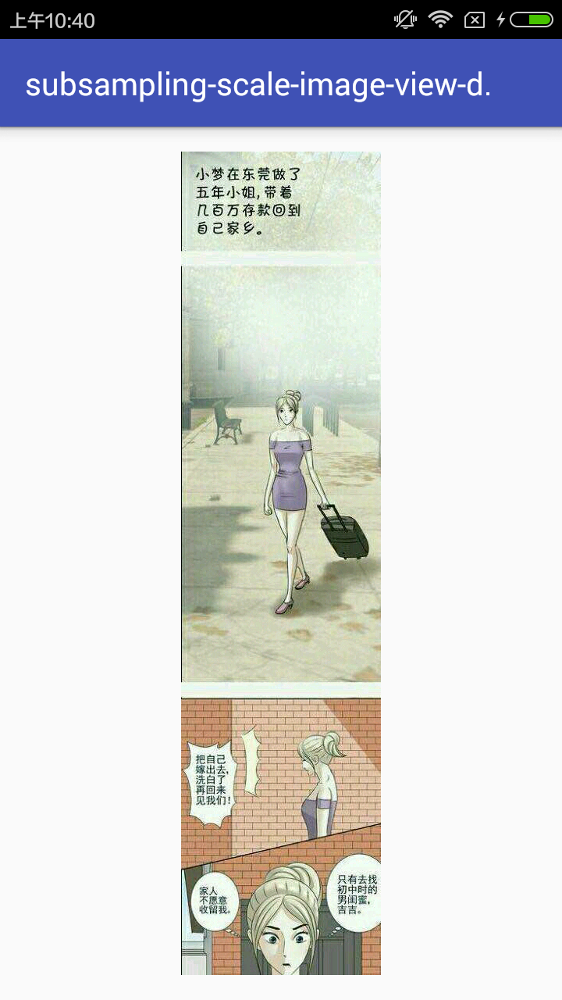

# subsampling-scale-image-view-demo
一个可以加载超大图(微博长图)的类库的测试demo

###用法：

###1.添加依赖
```c
com.davemorrissey.labs:subsampling-scale-image-view:3.5.0
```

###2.具体代码

```c
imageView = (SubsamplingScaleImageView) findViewById(R.id.imageView);

imageView.setMinimumScaleType(SubsamplingScaleImageView.SCALE_TYPE_CUSTOM);

imageView.setMinScale(1.0F);//最小显示比例

imageView.setMaxScale(10.0F);//最大显示比例（太大了图片显示会失真，因为一般微博长图的宽度不会太宽）

finalString testUrl ="http://cache.attach.yuanobao.com/image/2016/10/24/332d6f3e63784695a50b782a38234bb7/da0f06f8358a4c95921c00acfd675b60.jpg";

finalFile downDir = Environment.getExternalStorageDirectory();

//下载图片保存到本地
Glide.with(this)
     .load(testUrl).downloadOnly(new SimpleTarget<File>() {
            @Override
            public void onResourceReady(File resource, GlideAnimation<? super File> glideAnimation) {
                // 将保存的图片地址给SubsamplingScaleImageView,这里注意设置ImageViewState设置初始显示比例
                imageView.setImage(ImageSource.uri(Uri.fromFile(resource)), new ImageViewState(2.0F, new PointF(0, 0), 0));
        }});
```

###效果图：

<a href="art/01.png"></a>